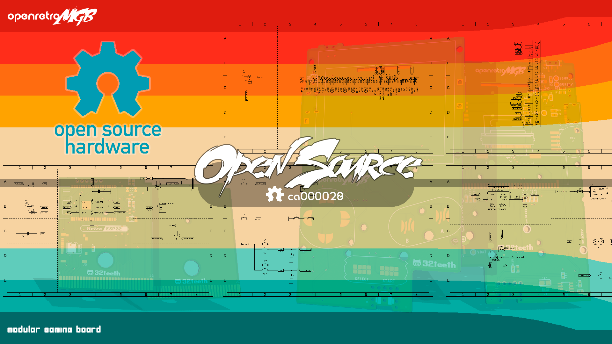
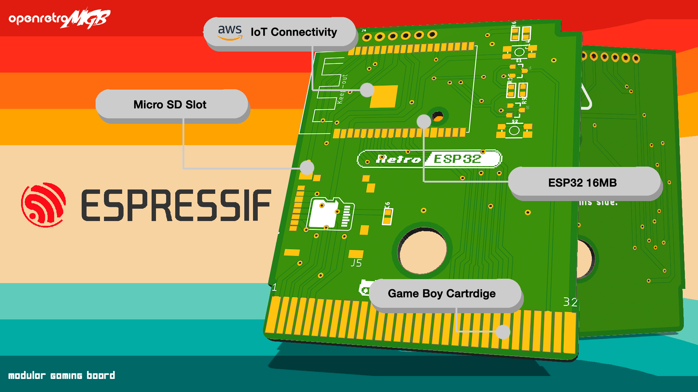
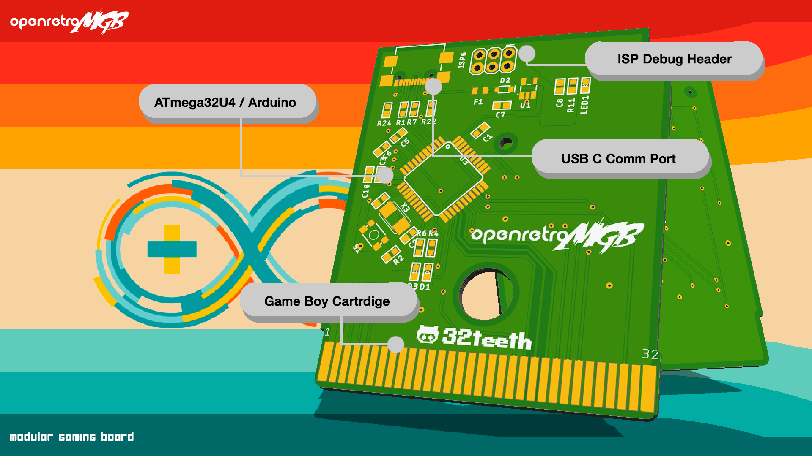
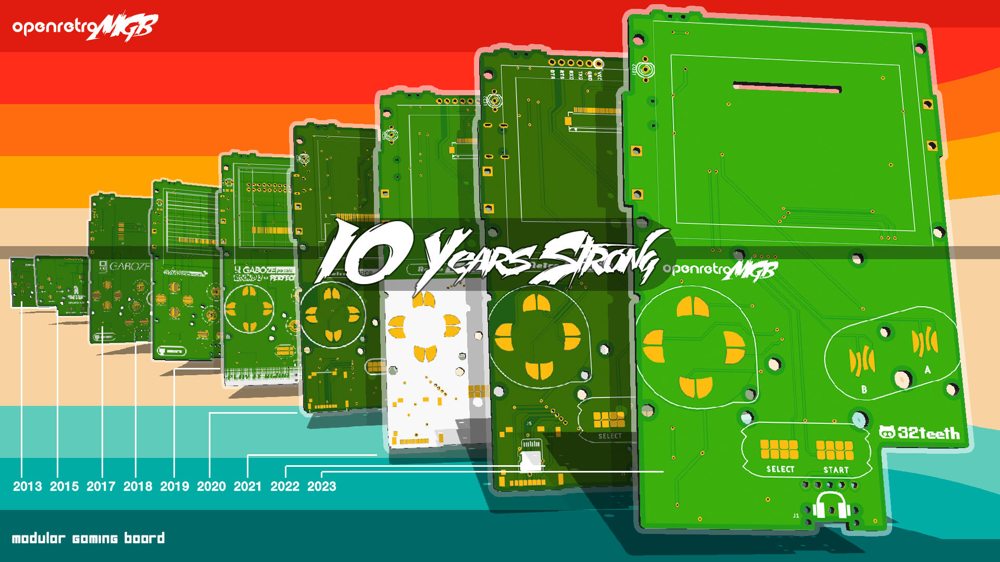

> Get ready to elevate your retro gaming experience with **OpenretroMGB** - the open-source, modular gaming board that lets you customize your gameplay. Our upcoming campaign will offer exclusive rewards and perks, so don't miss out on your chance to join the retro gaming revolution. Stay tuned for more details and be part of the community that's bringing back the best of the past with the power of the future!

## Overview

**OpenretroMGB** is a new open-source ***M***odular ***G***aming ***B***oard designed for gamers and hobbyists alike. Based on the popular Retro ESP32, this compact and portable board is compatible with Game Boy Pocket form factor and allows customers to either use the prebuilt ESP32 cartridge or design their own. With an easy-to-use modular design, gamers can customize their gaming experience by swapping out cartridges that feature different games or hardware functionalities. OpenretroMGB offers an affordable and accessible way to create and enjoy retro-style games with modern features, making it perfect for enthusiasts, hobbyists, and anyone looking for a fun, retro gaming experience.

**OpenretroMGB** is certified unde Open Source Hardware as OSHWA UID [CA000028](https://certification.oshwa.org/ca000028.html) with CC-BY-SA-4.0 licensing

## Features
- [x] Cartridge slot
- [x] 2.6" daylight IPS screen
- [x] Volume and brightness control
- [x] LiPo battery charging and protection circuitry
- [x] Stereo chip and headphone jack
- [x] Drop-in compatibility with Game Boy Pocket shell
- [x] Modular design
- [x] USB Data Lines
- [x] Open source

### Have your say

Join our discussions. Cast your vote in our [polls](https://github.com/openretroMGB/OpenRetroMGB/discussions/categories/polls)

## Gallery

#### Retro ESP32 Cart

#### Arduino *ATmega32U4* Cart

#### USB C Data Lines

# What will you build?

## Trusted Creators
> Celebrating 10 Years

Over the past 10 years, we have proudly established ourselves as a trusted creator and innovator in the realm of handheld retro gaming. From our early ventures with Arduino and Atmega microcontrollers to our exploration of cutting-edge technologies like ESP32 and Raspberry Pi, our journey has been driven by a relentless pursuit of innovation. With each step, we have strived to enhance the gaming experience for retro enthusiasts. Our Game Boy Pocket PCB embodies our dedication to quality, reliability, and creativity. It represents a culmination of years of expertise, resulting in a product that seamlessly blends the nostalgia of classic gaming with the power and possibilities of modern technology. As we celebrate this milestone, we extend our gratitude to our loyal customers and supporters, who have played an instrumental role in our growth and success. Looking ahead, we remain committed to pushing boundaries, embracing new advancements, and delivering unforgettable gaming experiences to enthusiasts around the world.

## Authors

* **Eugene Yevhen Andruszczenko** - *Initial and Ongoing Work* - [32teeth](https://github.com/32teeth)

### License

This project is licensed under the Creative Commons Attribution Share Alike 4.0 International - see the [LICENSE.md](LICENSE.md) file for details

## Support
> Although we do this for 💕 of 🕹️ 
> **We Also Like Coffee!**  
> *Please Consider Supporting*  

Did you know, you can support us in a few way? We offer multiple sposorship tiers, with different rewards!

Take a *look*.
See what *fits*.

 

**Thank You**